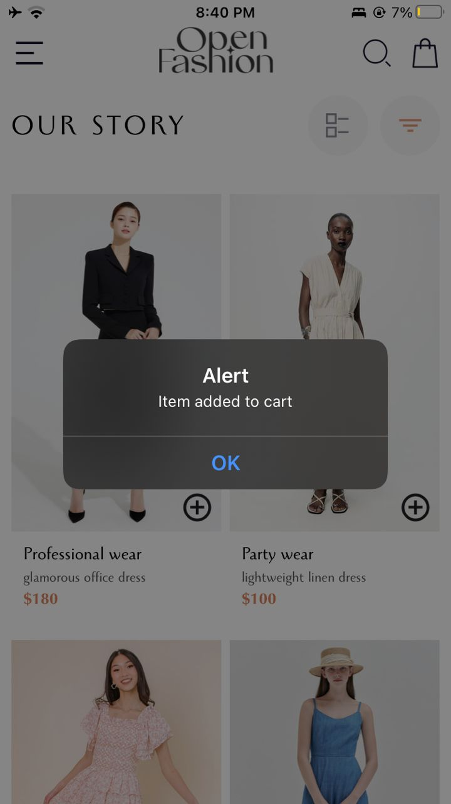
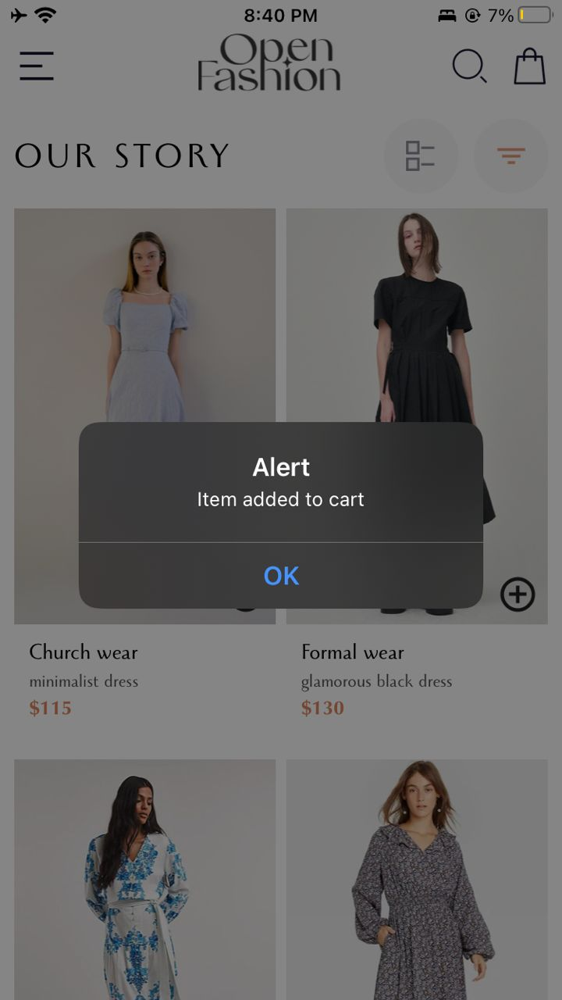
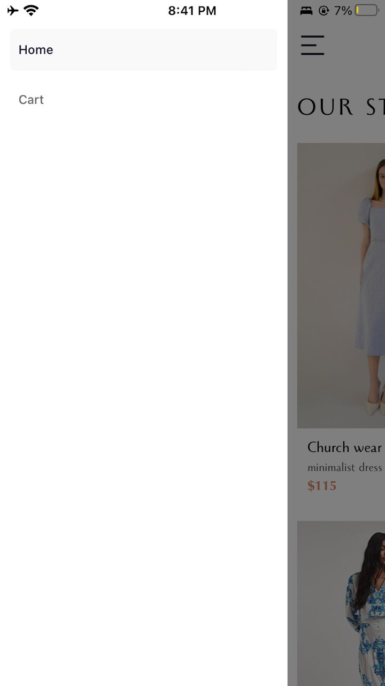
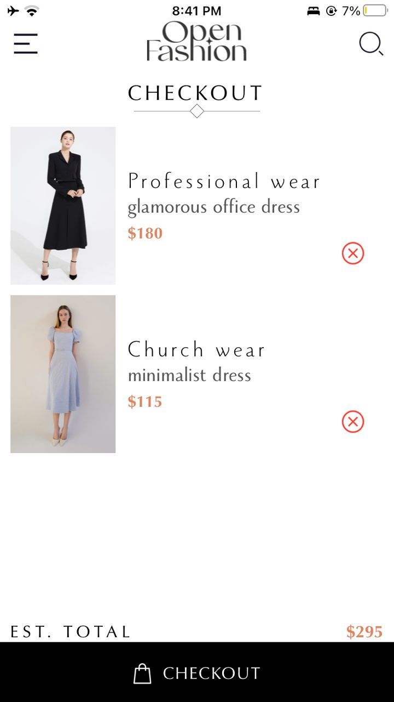
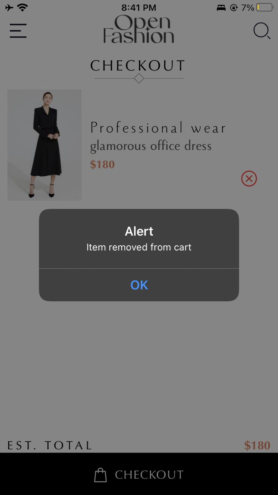
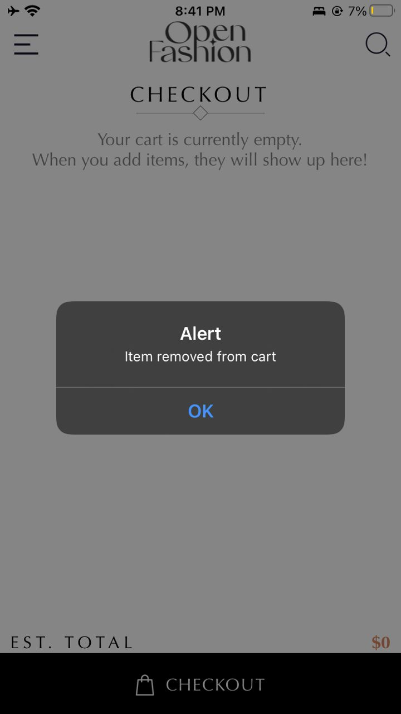
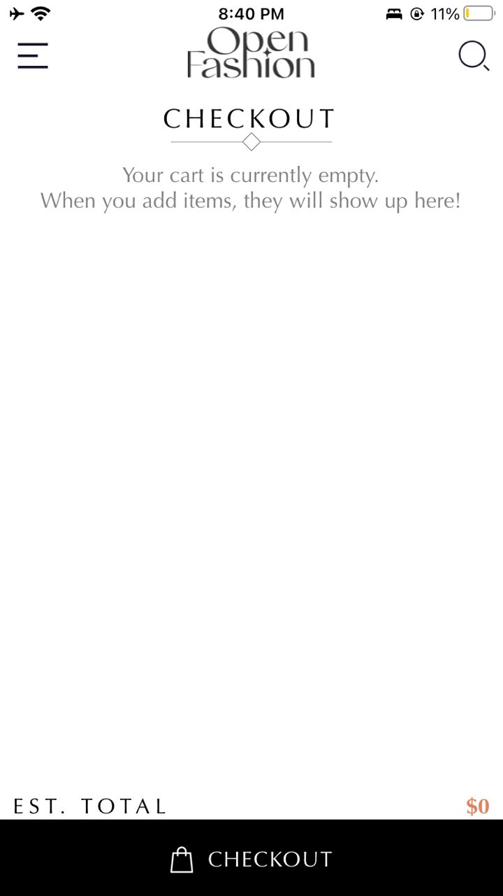

# React Native Shopping Application
## Student ID: 11014111
### Project Overview
This is a React Native application created using Expo CLI. It was created for my sixth assignment in Mobile Application Development. 

### What is this app?
The app is an online shopping application

### App Functionality
- **Browse Products**: Users can view available products in the home screen (which kind of serves as a catalogue)
- **Add to Cart**: Items can be added to the cart from the home screen.
- **View Cart**: Users can see the list of items added to their cart on the Cart screen.
- **Remove from Cart**: Items can be removed individually from the cart.
- **Calculate Total**: The app calculates and displays the total price of items in the cart.
- **Local Storage**: AsyncStorage is used to store users' cart items locally on their device.

### Project Structure
- [`app-screenshots`](./app-screenshots/): Contains screenshots of the application
- [`assets`](./assets/): Contains images and other assets used in the application, such as icons and images of products
- [`components`](./components/): Contains all reusable components used across different parts of the application. Each component is organized in a relevant subfolder.
- [`contexts`](./contexts/): Contains all contexts used in the application. In this application, there is only the cart context.
- [`local-storage`](./local-storage/): Contains localStorage.js, which sets up functions for storage management using AsyncStorage
- [`navigation`](./navigation/): Contains index.js, which sets up navigation using a drawer 
- [`screens`](./screens/): Contains the main screens (Home and Cart)
- [`styles`](./styles/): Contains styling files for the components and screens. All styles are organized in relevant subfolders.
- [`App.js`](./App.js): Main entry point of the app. It sets up the drawer component for navigating between screens.
- [`app.json`](./app.json): Configuration file for the Expo project, defining project settings and metadata
- [`babel.config.js`](./babel.config.js): Babel configuration file, used to specify how JavaScript code is compiled
- [`package-lock.json`](./package-lock.json): Automatically generated file that describes the exact tree of dependencies that were installed for the project
- [`package.json`](./package.json): Contains metadata about the project, including dependencies, scripts, and project info
- [`README.md`](./README.md): This README file, providing an overview and documentation for the project

### Components Structure And Usage
- #### HomeScreen
    - <u>Header</u>: Header for the Home screen, with the logo of the app's company.
    - <u>CatalogueHeader</u>: Header section with filter and list-type buttons
    - <u>ProductsList</u>: Renders a list of products as ProductCards        

- #### CartScreen
    - <u>CartScreenHeader</u>: Header for the cart screen
    - <u>CheckoutHeader</u>: Header that says 'CHECKOUT'
    - <u>CartItemsList</u>: Renders a list of cart items as CartItemCards.
    - <u>EstTotalAndCheckout</u>: Shows the estimated total of all items in the cart.

### Data Storage Implementation
In this application, AsyncStorage is used to store and retrieve cart items and the total amount locally on the device. 

- **Storing Items**: When an item is added to the cart, the current cart items and total amount are stored in AsyncStorage.
- **Retrieving Items**: When the app is loaded, the stored cart items and total amount are retrieved from AsyncStorage and set in the state.
- **Functions**: The functions `storeItem`, `getItem`, and `removeItem`, which I created in [`localStorage.js`](./local-storage/localStorage.js) are used to interact with AsyncStorage.

### Technology Stack Used

- React Native
- Expo CLI
- Other dependencies found in the [`package.json`](./package.json) file

### Clone This Repository
- Open your terminal and navigate to the folder you want this repository to be cloned.
- Paste the following command
```
git clone https://github.com/favourrr-a/rn-assignment6-11014111.git
```
- Navigate to the project directory
```
cd rn-assignment6-11014111
```

### Test This App
#### Prerequisites
- Have Node.js installed

#### Steps
- First clone the repository using the steps above
- Make sure to navigate to the project directory
- Install expo
```
npm install expo
```
- Install dependencies found in the [`package.json`](./package.json) file
- Run the application
```
npx expo start
```
- Follow the steps that show up after entering the above command

### Screenshots Of The Application
## Home Screen

### Adding items to cart


## Drawer

## Cart Screen
### Items that were added to cart


### Removing items from cart



### Cart screen when there are no items in cart
